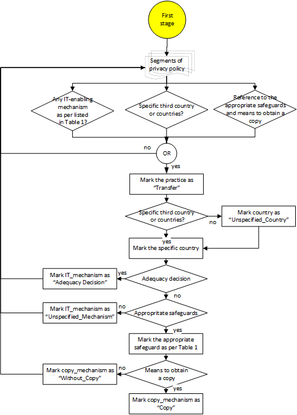
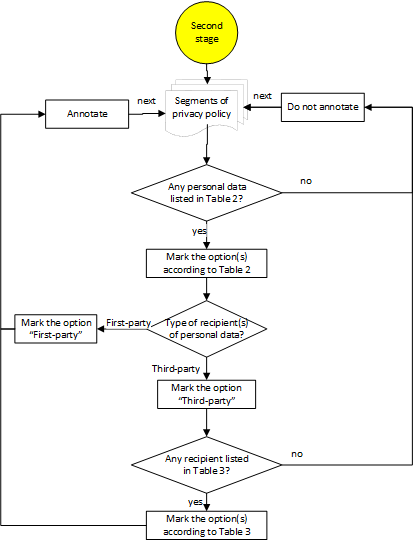

# Annotation procedure

## Stage 1

## Stage 2

## General rules
 - Some policies include links to external or complementary information. For this study, a privacy policy will be analysed solely based on its content and not on any external information (e.g. links to additional information)
 - Only parameters that fall into the annotation scheme should be annotated. For instance, while health data is highly relevant for GDPR compliance, we do not annotate this type of data as the CLIIP platform currently is not able to them. It could be considered in future work. 
 - While a practice regarding the transfer of personal data to third countries should describe all its parameters altogether, it can also be derived from a systematic reading of the policy. For example, a policy segment can state "your information might end up on one of those computers in another country", and the specific personal data can be stated in other policy segments.   
 - An annotation of collection/transfer of a personal data should be made regardless of whether the policy explicitly mentions that the application is the means for collecting the data. Thus, it will be annotated even when the collection is by phone, email or other means. 
 - Similarly, if the privacy policy restricts a collection/transfer practice to a particular transmission principle (e.g., login, consent, opt-in or opt-out), we assume that this principle is met, i.e., that the user has logged in or given consent, etc.  As under some circumstance the exception may apply and the information may be transfered to a third country.  
## Specific rules
| Transparency element     | Simplifying assumptions  |
|--------------------------|--------------------------|
| Transfer intention | Any statement suggesting transfer to other countries should be coded as TRANSFER, although not written in the GDPR context |
| Target country | Statements including "any country around the world", "any country", "outside the EEA" or similar should be coded as "UNSPECIFIED_COUNTRY" |
| Target country | "Privacy Shield" is an adequacy decision targeting transfers to USA, therefore target_country should be coded as "USA" |
| Target country | Statements declaring cities instead of countries should annotate the country |
| Standard_Data_Protection_Clauses | Related terms: Standard contractual clauses, contracts approved by the european commission, data protection model contracts,  model contract clauses, data processing addendum, european commission approved contractual terms, standard contractual model clauses, contracts in the form approved by the european commission |
| Adequacy_Decision |It does not require reference to safeguards nor a reference to get a copy |
| Explicit_Consent | It does not require reference to safeguards nor a reference to get a copy |
| Explicit_Consent | Tacit consent statements, such as "by using the service you consent to this kind of transfer" is not an Explicit_Consent|
| Explicit_Consent |  "Consent" is not the same as " Explicit_Consent", this term alone cannot be used to label the 'Explicit_Consent' mechanism |
| Approved_Certification_Mechanism | Privacy Shield is referred as a certification in some privacy policies, but it is a type of Adequacy Decision in the meaning of GDPR |
| Copy_Means| A reference to get a copy could be a link or contact information, including email, phone number, etc.| 
| Copy_Means | Annotate it only when a safeguard is defined |  
